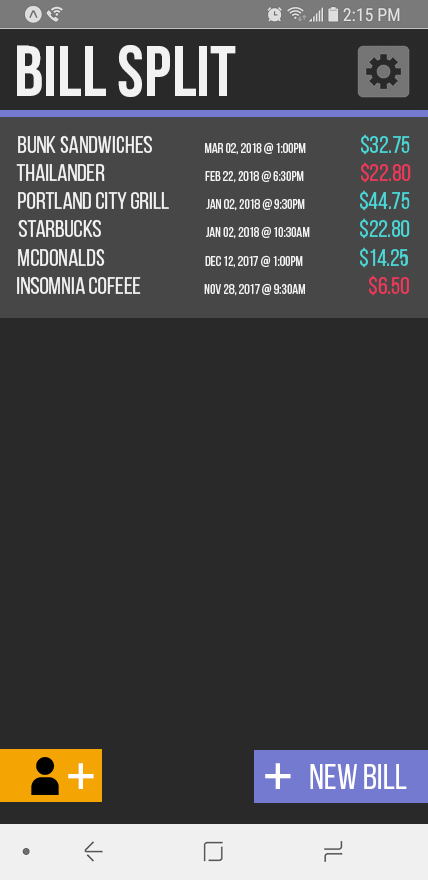
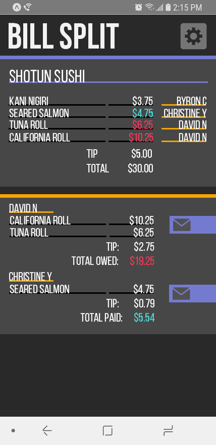
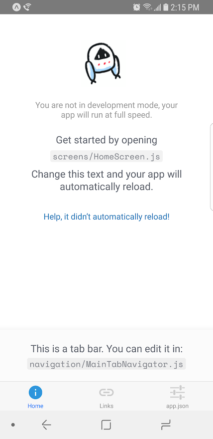

# Angular Extended

JavaScript Week 4 - Creating a clean and polished application.

## Current Status
This is still a work in progress. See Application Dev Plan

## Submission: Personal Development
Explore creating a clean and functional application that I personally will be using on a regular basis. Current concern is that all the applications I've made up to this point has only been exercises for a concept.

Spent some initial time going through the motions of creating an app. I Started going into details of what I would like to create. Once the research begun, I started digging into all the different technologies i would like to eventually leverage.

I have a strong need to start seeing a plan before developing so I started on some early concepts and layout planning.

There were a lot of questions, that range from using Google Drive accounts and how to use React Native.

Ultimate goal for myself is to create a fully functional application.

### Application Bill-Splitter
This might be a larger undertaking, but this will be one of my main goals out of Epicodus. Creating a functional bill splitting app that I and others will want to use is going to be a struggle for finding and tackling bugs and inconsistencies.

| Front Page | Create Bill Page |
|---|---|
|  |  |

### Application Research
- [Google OAuth 2.0](https://developers.google.com/identity/protocols/OAuth2) -Unique sign in for google drive
- [Google Sheets API](https://developers.google.com/sheets/api/) - Researching how to output information into google sheets and a personal record keeper.
- [Free OCR](http://www.free-ocr.com/) - Research how to parse text from images
- [Ocrad.js](http://antimatter15.com/ocrad.js/demo.html) - Possible text from image js

### Application Dev Plan
- [x] Create Baseline objects and routers.
- [ ] Connect to Firebase for initial data creation and storage
- [ ] Implement OAuth2
- [ ] Connect individual sign-ins with Google Sheets
- [ ] Store parsed data into google sheets so the user can easily see and modify cost information.
- [ ] Re-pull from google sheets to get updated data.
- [ ] Possibly implement REACT Native to publish to Android and IOS
- [ ] Use Expo.io

| Objectives | Current Progress Details|
| --- | --- |
| Implement OAuth2 | Google Drive [OAuth 2.0](https://developers.google.com/identity/protocols/OAuth2)  |
|Google Sheets | Based on [REST](https://developers.google.com/sheets/api/reference/rest/) routes. GET and POST are used to add and retrieve data from Google Sheets.  |
| Use React Native | [React Native](http://facebook.github.io/react-native/): From initial research, React Native can be built in atom and angular.  |
| Expo.io | [Expo.io](https://expo.io/): Created sample phone application by using Expo to quickly deploy to my phone.  |

## Development server
Run `ng serve` for a dev server. Navigate to `http://localhost:4200/`. The app will automatically reload if you change any of the source files.

## About Project
This project was generated with [Angular CLI](https://github.com/angular/angular-cli) version 1.0.0.

### Author
**Byron Chang**
